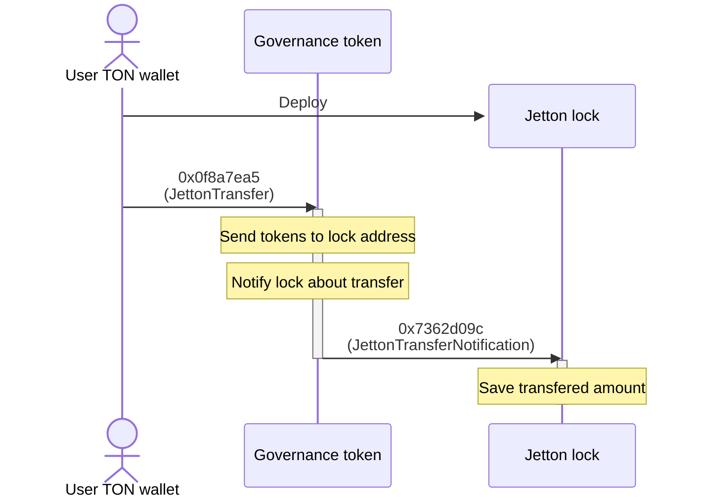
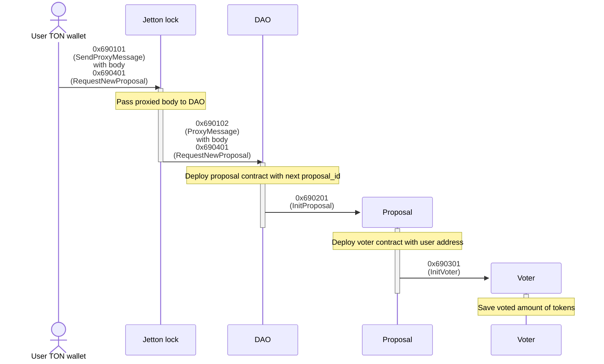
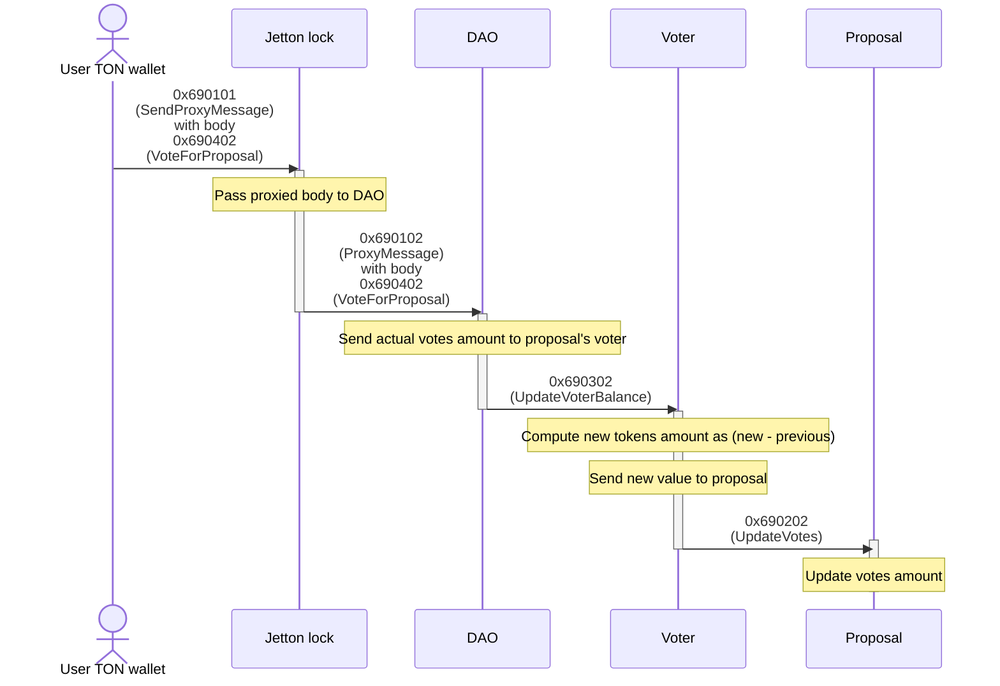

# Skipper 🐧

ℹ️ Fully decentralized application for DAO managing on TON blockchain using governance tokens (jettons).

⚠️ <b>Warning! Work in progress!</b> Development of this project is not done!

❤️ I'll be very grateful for any kind of contribution: code, docs, issues, bug reports, github stars or whatever

<!-- # Deploy TODO -->

# Development

This is default Tact blueprint project with default commands:

- `npm run build` - build project and compile contracts
- `npm test` - run contracts tests
- `npx blueprint run` - execute script from `/scripts` directory

# Docs

## Exit codes

[Standard Tact exit codes](https://docs.tact-lang.org/book/exit-codes)

Skipper uses custom exit codes for identifying non standard errors. It always 4 digit decimal code with following structure: `69XX` where 69 is prefix for every error and XX is unique number for each error.

<table>
    <tr>
        <th>Code</th>
        <th>Description</th>
    </tr>
    <tr><td colspan=2>Tact lang exit codes:</td></tr>
    <tr>
        <td>132</td>
        <td>
            Invalid owner of contract. <i>Occurs when contract receives message not from owner address.</i>
        </td>
    </tr>
    <tr><td colspan=2>Custom exit codes:</td></tr>
    <tr>
        <td>6901</td>
        <td>No enoght TON in message.</td>
    </tr>
    <tr>
        <td>6902</td>
        <td>Unlock date is not arrived. <i>Occurs on trying to unlock jettons before unlock date.</i></td>
    </tr>
    <tr>
        <td>6903</td>
        <td>No enough votes. <i>Occurs when trying to execute proposal that has no enough votes.</i></td>
    </tr>
    <tr>
        <td>6904</td>
        <td>Too many "no" votes. <i>Occurs when trying to execute proposal that has too many "no" votes.</i></td>
    </tr>
    <tr>
        <td>6905</td>
        <td>Not initialized. <i>Occurs when trying to interact with contract that has not been initialized.</i></td>
    </tr>
    <tr>
        <td>6906</td>
        <td>Already initialized. <i>Occurs when trying to initialize contract that has been already initialized (to avoid double initialization).</i></td>
    </tr>
    <tr>
        <td>6907</td>
        <td>Proposal expired. <i>Occurs when trying to vote in expired proposal.</i></td>
    </tr>
    <tr>
        <td>6908</td>
        <td>Proposal executed. <i>Occurs when trying to vote in executed proposal.</i></td>
    </tr>
    <tr>
        <td>6909</td>
        <td>Proxy opcode not found. <i>Occurs when trying to send unknown proxy body to Skipper contract.</i></td>
    </tr>
</table>

## Contracts interaction

### Lock tokens

### Create new proposal

### Vote for existing proposal

