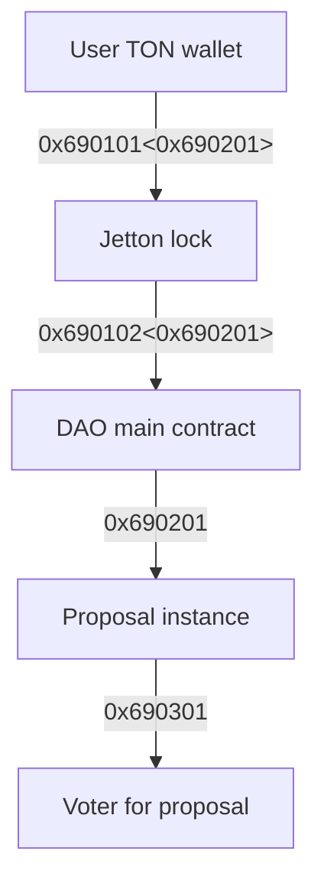
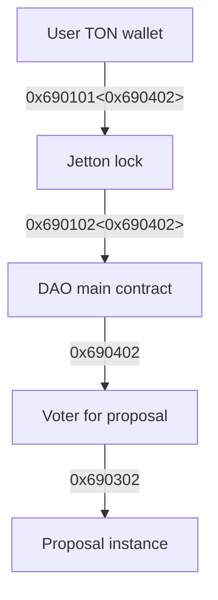

# Skipper 🐧

ℹ️ Fully decentralized application for DAO managing on TON blockchain using governance tokens (jettons).

⚠️ <b>Warning! Work in progress!</b> Development of this project is not done!

❤️ I'll be very grateful for any kind of contribution: code, docs, issues, bug reports, github stars or whatever

<!-- # Deploy TODO -->

# Development

This is default Tact blueprint project with default commands:

- `npm run build` - build project and compile contracts
- `npm test` - run contracts tests
- `npx blueprint run` - execute script from `/scripts` directory

# Docs

## Contracts

<b>TODO!</b>

## Creating proposal

## Voting in proposal

