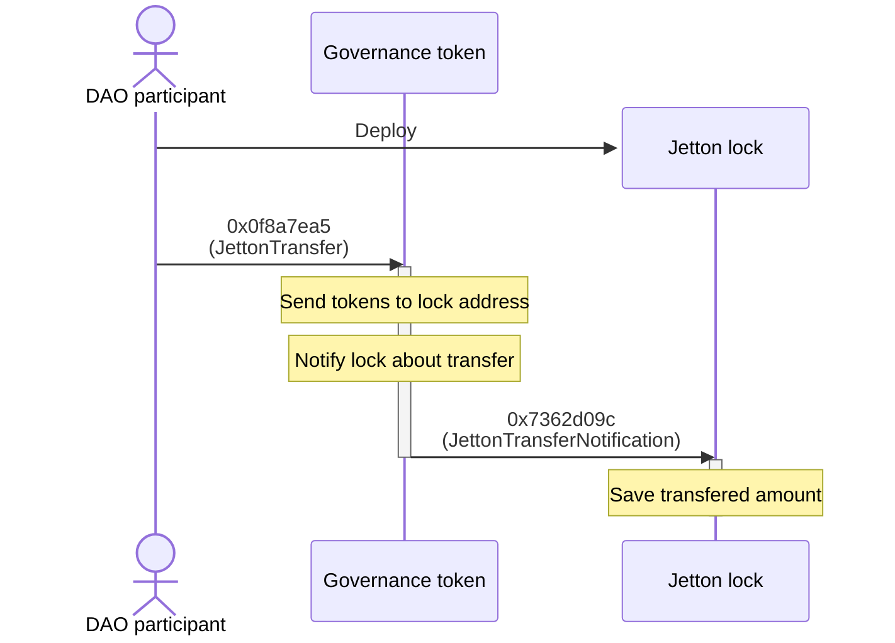
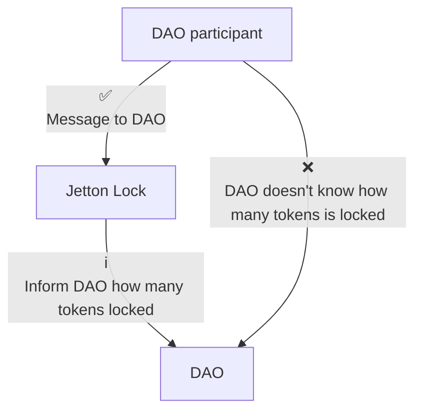
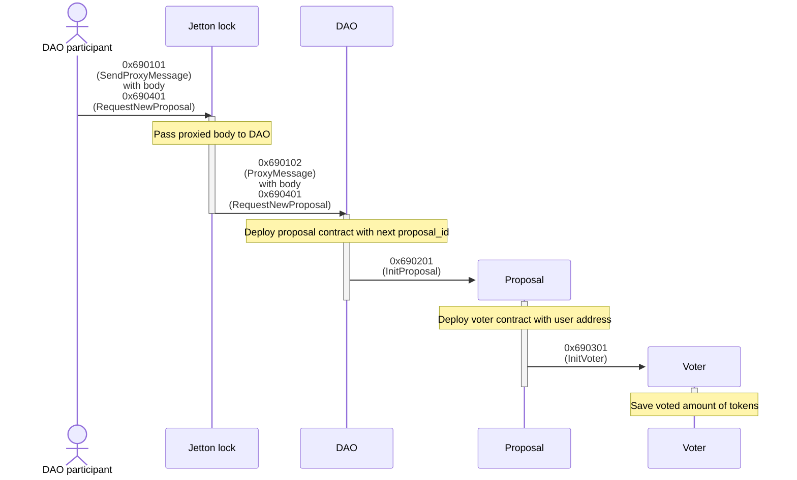
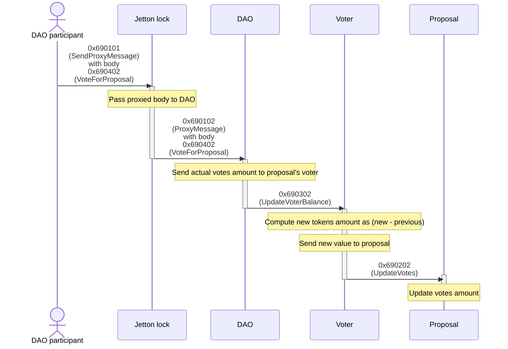

# Skipper application architecture

Below is architecture of Skipper smart contracts. This document cold be useful for people who want to understand how decision making process is work:

-   Contributors who want improve protocol
-   Developers who build applications on top of Skipper

## Entities

### Participant

**Participant** is any ton address (for example TON wallet) who owns DAO governance token

### Governance token

Specific TON jetton, that was chosen to be **governance token**. It can be any smart contract implementing the following standards:

-   [TEP-64](https://github.com/ton-blockchain/TEPs/blob/master/text/0064-token-data-standard.md) - Token Data Standard
-   [TEP-74](https://github.com/ton-blockchain/TEPs/blob/master/text/0074-jettons-standard.md) - Fungible tokens (Jettons) standard
-   [TEP-89](https://github.com/ton-blockchain/TEPs/blob/master/text/0089-jetton-wallet-discovery.md) - Discoverable Jettons Wallets

[See SupaDupaDAO jetton implementation](https://github.com/supadupadao/jetton)

### Jetton lock

Smart contract that receives governance tokens and lock it for a while to avoid multiple voting.

Read more about how Skipper [count votes](#vote-for-existing-proposal) and why jettons do not [double counted](#lock-tokens)

### DAO

Root DAO smart contract. It deploys in single instance. It also do many following things:

-   Receives participant messages and creates proposals or sends votes to them
-   It is kind of DAO treasury. If Skipper used to manage application, governed application should use this contract as owner

### Proposal

Smart contract that stores in itself proposed action (e.g. toncoin transfer or contract call) and voting results. It deploys isolated on each proposal. So every proposal has it own address, deployed smart contract instance and storage.

### Voter

Smart contract that stores in itself information about single participant vote. It deploys on each proposal and on each participant in it.

## Workflow

### Lock tokens

To avoid multiple voting Skipper obliges participants to lock their governance tokens. If it doesn't do this, it impossible find out is participant has voted or not, so it could send multiple votes.

So participant lock it tokens in special smart contract as displayed below:

What's actually happening there is this: DAO participant transfer its jettons to jetton lock wallet and jetton lock receive Transfer Notification message that means that now tokens are belongs to lock contract.

There are issue to find out inside other contracts how many tokens participant locked. Other contracts can't simple ask lock about it, because it overcomplicate on-chain logic and therefore increase gas consumption. It was decided to use Jetton Lock contract as proxy that send amount of locked tokens and send some additional info that help to check is this lock is really belong to specific participant by generating contract address.

### Create new proposal

As above was described: jetton lock is proxy contract. So every interaction with DAO that related with proposals goes through Jetton Lock.

When DAO receives proxy message it deploys Proposal contract which deploys Voter contract. In that exact order.

Lock notifies about amount of tokens locked so all contracts following it in the chain know it amount. Proposal saves it value to "for" votes. Voter saves it to know in future how many tokens are already used in voting.

### Vote for existing proposal

This operation has same flow as above. But it has big differences:

-   Different proxy body
-   Different order of message chain.

    In previous case message goes in following order: Lock -> DAO -> **Proposal -> Voter**.

    In that case message goes in following order: Lock -> DAO -> **Voter -> Proposal**.

    That's because Proposal have to increase votes count but it can't do it without previous vote value from this participant: Lock stores only locked amount of tokens and know nothing about votes, Proposal stores only amount of "for" and "against" votes and know nothing how many specific user's vote. This know Voter contract.

    Because if participant lock 100 tokens, send vote with this amount, lock 100 tokens more, and send vote with new amount, Proposal should save 100 votes in first case and 100 votes more in second case. Not 100 votes in first case and 200 votes in second case

    **Voter -> Proposal** way fixes this. In example above Voter will store 100 tokens and in second message it check that 100 tokens are already stored and will deduct it from second message amount

## Exit codes

[Standard Tact exit codes](https://docs.tact-lang.org/book/exit-codes)

Skipper uses custom exit codes for identifying non standard errors. It always 4 digit decimal code with following structure: `69XX` where 69 is prefix for every error and XX is unique number for each error.

<table>
    <tr>
        <th>Code</th>
        <th>Description</th>
    </tr>
    <tr><td colspan=2>Tact lang exit codes:</td></tr>
    <tr>
        <td>132</td>
        <td>
            Invalid owner of contract. <i>Occurs when contract receives message not from owner address.</i>
        </td>
    </tr>
    <tr><td colspan=2>Custom exit codes:</td></tr>
    <tr>
        <td>6901</td>
        <td>No enoght TON in message.</td>
    </tr>
    <tr>
        <td>6902</td>
        <td>Unlock date is not arrived. <i>Occurs on trying to unlock jettons before unlock date.</i></td>
    </tr>
    <tr>
        <td>6903</td>
        <td>No enough votes. <i>Occurs when trying to execute proposal that has no enough votes.</i></td>
    </tr>
    <tr>
        <td>6904</td>
        <td>Too many "no" votes. <i>Occurs when trying to execute proposal that has too many "no" votes.</i></td>
    </tr>
    <tr>
        <td>6905</td>
        <td>Not initialized. <i>Occurs when trying to interact with contract that has not been initialized.</i></td>
    </tr>
    <tr>
        <td>6906</td>
        <td>Already initialized. <i>Occurs when trying to initialize contract that has been already initialized (to avoid double initialization).</i></td>
    </tr>
    <tr>
        <td>6907</td>
        <td>Proposal expired. <i>Occurs when trying to vote in expired proposal.</i></td>
    </tr>
    <tr>
        <td>6908</td>
        <td>Proposal executed. <i>Occurs when trying to vote in executed proposal.</i></td>
    </tr>
    <tr>
        <td>6909</td>
        <td>Proxy opcode not found. <i>Occurs when trying to send unknown proxy body to Skipper contract.</i></td>
    </tr>
</table>
