# Skipper Application Architecture

This document describes the architecture of the Skipper smart contract system. It is useful for:

* Contributors who want to improve the protocol
* Developers building apps on top of Skipper

## 🧱 Entities

### Participant

Any TON address (e.g. a wallet) that owns governance jettons.

### Governance Token

A specific Jetton used for governance. Must implement the following standards:

* [TEP-64](https://github.com/ton-blockchain/TEPs/blob/master/text/0064-token-data-standard.md)
* [TEP-74](https://github.com/ton-blockchain/TEPs/blob/master/text/0074-jettons-standard.md)
* [TEP-89](https://github.com/ton-blockchain/TEPs/blob/master/text/0089-jetton-wallet-discovery.md)

### Jetton Lock

A smart contract that holds locked governance jettons. Required to:

* Prevent double voting
* Track the amount locked per participant

See ["Vote for existing proposal"](#vote-for-existing-proposal) and ["Lock tokens"](#lock-tokens) for rationale.

### DAO (`Skipper`)

The root contract that:

* Receives messages from participants
* Deploys proposals
* Acts as the treasury and central governance entrypoint

### Proposal

A smart contract that contains:

* A specific action (e.g. transfer TON, call contract)
* Voting results
  Each proposal is deployed as a standalone contract.

### Voter

A per-participant, per-proposal contract that:

* Stores how many tokens the participant has used to vote
* Allows proper vote updates when lock amount changes

---

## 🔄 Workflow

### Lock Tokens

To vote, participants must lock jettons in a `Jetton Lock` contract. This prevents double voting.

### Why Proxy?

Other contracts can't directly query a lock's state. Instead, the lock sends the amount and metadata to the DAO.

```mermaid
flowchart TD
  participant[DAO participant]
  lock[Jetton Lock]
  dao[DAO]

  participant --✅<br/>Message to DAO--> lock --ℹ️<br/>Inform DAO how many tokens locked--> dao
  participant --❌<br/>DAO doesn't know how many tokens is locked--> dao
```

---

### Create a Proposal

All proposal-related messages go through the lock (proxy pattern).

---

### Vote for Existing Proposal

Voting flow differs from proposal creation:

* Order: Lock -> DAO -> **Voter -> Proposal**
* Rationale: only `Voter` knows how much has been used previously. It computes the difference.

---

## 🚨 Exit Codes

Skipper uses:

* [Tact Standard Exit Codes](https://docs.tact-lang.org/book/exit-codes)
* Custom `69XX`-series codes

| Code | Description                                                      |
| ---- | ---------------------------------------------------------------- |
| 132  | Invalid owner (Tact standard)                                    |
| 6901 | Not enough TON in message                                        |
| 6902 | Unlock date hasn't arrived                                       |
| 6903 | Not enough YES votes to execute proposal                         |
| 6904 | Too many NO votes for proposal                                   |
| 6905 | Contract is not initialized                                      |
| 6906 | Contract already initialized                                     |
| 6907 | Proposal expired                                                 |
| 6908 | Proposal already executed                                        |
| 6909 | Proxy opcode not found                                           |
| 6910 | Unlock date is insufficient to cover proposal expiration date    |
| 6911 | Lock period must be greater than zero                            |
| 6912 | Lock period is too short and does not extend current unlock date |
| 6913 | Amount provided must be greater than zero                        |
| 6914 | Insufficient storage fee for the contract                        |
| 6915 | Invalid expiration time for proposal or voter                    |
| 6916 | Invalid owner address for jetton wallet                          |

