# Governance Principles in Skipper DAO

This document describes the key governance rules and assumptions used in the Skipper DAO protocol.

These principles define how decisions are made, how voting power is determined, and how system integrity is maintained.

> ⚠️ This is an early version of the protocol. Governance logic and rules may change in future versions. Feedback and proposals for improvements are welcome.

---

## 🗳 Voting Power

* Voting power is based on the number of **governance jettons** locked by a participant.
* Jettons must be locked in a `Lock` contract to be counted.
* Voting power is recorded at the time of interaction with the DAO (e.g., creating a proposal or voting).
* Locked tokens can be used to vote in multiple proposals simultaneously.

---

## 🔒 Locking Jettons

* Participants must lock jettons before voting or creating proposals.
* Locking creates a unique `Lock` contract per participant.
* Each lock has:

  * Locked jetton amount
  * Unlock date (determined by participant)

**Why lock?**

* Prevents double-voting by tying governance power to locked tokens.
* Ensures that voting power is committed during the proposal period.

---

## 🔧 Proposal Actions
Proposals can execute arbitrary actions, such as:

* Sending TON to an address
* Calling external contracts (with payloads)
* Updating state in governed contracts (e.g., configuration)

> ⚠️ The Skipper contract must be the owner of the governed contract for execution to succeed.

---

## 👤 Proposal Creators
Any participant with locked jettons can create a proposal.
The amount of jettons at creation time is recorded and added to the YES votes immediately.
Proposal creation consumes gas; participants should have enough TON to cover fees.

---

## 🧭 Proposal Lifecycle

```mermaid
flowchart TD
  A[Created]
  B[Active]
  C1[Passed<br/>YES ≥ 30,000 AND YES - NO ≥ 10,000]
  C2[Rejected<br/>Insufficient votes OR<br/>NO too high]
  D[Executed]

  A --> B
  B --> C1
  B --> C2
  C1 --> D
```

---

## 🔄 Lock Extension

* When a participant votes on a proposal, the unlock date of their lock is automatically **extended** to match the proposal’s expiration time (if later).
* This ensures participants cannot unlock tokens while their vote is still active.

---

## 🔓 Unlocking

* Tokens can only be unlocked **after the unlock date**.
* Additionally, tokens **cannot** be unlocked if the lock was used to vote in any active proposal.
* Once unlocked, the lock contract is deactivated, and tokens are returned to the participant.

---

## ✅ Proposal Requirements

To pass, a proposal must:

1. Receive **at least 30,000** YES votes (jettons)
2. Have **at least 10,000 more YES votes** than NO votes
3. Be executed **after its expiration time**

If these conditions are met, any participant can trigger execution.

---

## ❌ Rejection Conditions

A proposal is rejected when:

* It does not reach 30,000 YES votes
* The margin between YES and NO is less than 10,000 tokens
* Voting period has expired without satisfying both criteria

---

## 🕒 Voting Duration

* Each proposal has a custom expiration timestamp.
* By default, this is set to **14 days**, but it can be changed when the proposal is created.
* Votes submitted after the expiration are ignored.

---

## ⚠️ Proposal Execution

* Anyone can trigger proposal execution **after expiration**.
* The DAO verifies the conditions above before executing the action.

---

## ⛔ Security Assumptions

* Jetton must conform to TEP-74 and TEP-89 for compatibility.
* Voting relies on deterministic contract addresses (Lock, Proposal, Voter).
* Participants are expected to understand lock durations and vote deadlines.

---

This document reflects the current governance logic hardcoded in Skipper contracts. It serves both as documentation and a contract-level spec.

> 💬 Feedback, improvement proposals, and design discussions are welcome.
