```mermaid
flowchart LR
   proposal_author[🙋‍♂️<br/>DAO participant]

   proposal[🗳️<br/>Proposal]

   proposal_author --🆕--> proposal
```

```mermaid
flowchart LR
   voter1[🙋‍♀️<br/>DAO participant]
   voter2[🙋<br/>DAO participant]

   proposal[🗳️<br/>Proposal]

   voter1 --✅--> proposal
   voter2 --❎--> proposal
```

```mermaid
flowchart LR
   proposal[🗳️<br/>Proposal]
   A@{ shape: f-circ, label: "Junction" }

   proposal --💸--> A
```

# Skipper docs

This documentation describes Skipper project.
Skipper is Decentralized Autonomous Organization (DAO) protocol working on TON blockchain and smart contracts written in Tact lang.

## How it works?

Decentralized Autonomous Organization (DAO) is managed via making participant-based decisions. Participants is holders of specific jetton, that acts as vote power. Decisions making is controlled by smart contracts in which described rules of DAO workflow.

```mermaid
graph
   participant1[🙋‍♂️<br/>DAO participant]
   participant2[🙋‍♀️<br/>DAO participant]
   participant3[🙋<br/>DAO participant]

   subgraph TON Blockchain
   skipper[📄<br/>DAO smart contracts]
   decision[✅<br/>DAO decision]
   end

   participant1 --vote<br/>✅--> skipper
   participant2 --vote<br/>✅--> skipper
   participant3 --vote<br/>✅--> skipper

   skipper --> decision
```

-   To become DAO participant it need to have specific for this DAO jetton.
-   Vote power is depend of amount of jetton participant have.

## Proposal lifecycle

> [!NOTE]
> Proposal entity in Skipper terminology is action that proposed by participant, that will be performed by DAO.
>
> E.g. participant propose transfer toncoins from DAO treasury to some other address. If all participants agree, it will be performed

### 1. New proposal

Participant create new proposal and thus initiates voting for it

### 2. Voting

Other interested participants votes for or against in the proposal.

### 3. Executing

If proposal received required amount of "for" votes, DAO performs proposed action.

Otherwise proposal closes, DAO ignores this proposal and performing no actions

## Useful links

-   [Decentralized autonomous organizations (DAOs)](https://ethereum.org/en/dao/) on ethereum.org
-   [What is a DAO in Crypto?](https://youtu.be/KHm0uUPqmVE)
-   [DAOs, DACs, DAs and More: An Incomplete Terminology Guide](https://blog.ethereum.org/2014/05/06/daos-dacs-das-and-more-an-incomplete-terminology-guide)
-   [A Primer on DAOs](https://corpgov.law.harvard.edu/2022/09/17/a-primer-on-daos/)
