# Skipper – DAO Smart Contracts on TON

**Skipper** is a modular smart contract framework for building Decentralized Autonomous Organizations (DAOs) on the **TON blockchain**, written in [Tact](https://tact-lang.org).

It allows communities to manage treasury, vote on proposals, and coordinate governance decisions using **jetton-based voting power**.

---

## 🚀 Overview

Skipper enables onchain DAO governance with the following flow:

1. **Jetton holders** lock their tokens to participate in governance.
2. Participants **create proposals** (e.g. transfer funds, whitelist address).
3. Other token holders **vote FOR or AGAINST** the proposal.
4. If the proposal meets the required quorum and support threshold, it is executed onchain.

> 🧠 Voting power is proportional to the amount of jettons locked by the participant.

---

## 🔁 Governance Lifecycle

### 1. Create Proposal

Any participant can initiate a proposal.

```mermaid
flowchart LR
   author[🙋‍♂️<br/>DAO participant]
   proposal[🗳️<br/>Proposal]
   author -- 🆕 Create --> proposal
````

---

### 2. Voting

Token holders vote FOR ✅ or AGAINST ❎ the proposal.

```mermaid
flowchart LR
   voter1[🙋‍♀️<br/>DAO participant]
   voter2[🙋<br/>DAO participant]
   proposal[🗳️<br/>Proposal]
   voter1 -- ✅ --> proposal
   voter2 -- ❎ --> proposal
```

---

### 3. Execution

If enough FOR votes are collected (based on quorum and threshold), the DAO executes the proposed action.

```mermaid
flowchart LR
   proposal[🗳️<br/>Proposal]
   action[💸<br/>Execute Action]
   proposal -- Passed --> action
```



If not enough support is received, the proposal is closed with no effect.

---

## 📦 Components

The system consists of several core contracts:

| Contract   | Description                                                   |
| ---------- | ------------------------------------------------------------- |
| `Skipper`  | Root DAO contract, stores configuration and manages proposals |
| `Proposal` | A proposal instance with its own lifecycle and vote tracking  |
| `Voter`    | Manages per-user voting logic                                 |
| `Lock`     | Handles locking of governance jettons                         |

---

## 🧪 Try it in Testnet

You can experiment with Skipper on TON testnet.

* [SupaDupaDAO testnet](http://dao.supadupa.space)

---

## 📚 Learn more about DAOs

* [What is a DAO? (Ethereum.org)](https://ethereum.org/en/dao/)
* [A Primer on DAOs – Harvard Law](https://corpgov.law.harvard.edu/2022/09/17/a-primer-on-daos/)
* [DAOs, DACs, and More](https://blog.ethereum.org/2014/05/06/daos-dacs-das-and-more-an-incomplete-terminology-guide)

---

## 🤝 Contributing

Want to help improve Skipper? We’d love your support!

See [CONTRIBUTING.md](CONTRIBUTING.md) for instructions on:

* Reporting bugs
* Proposing features
* Running tests and developing contracts locally

---

## 📜 License

This project is open-source under the [MIT License](LICENSE).