# Skipper docs

This documentation describes Skipper project.
Skipper is Decentralized Autonomous Organization (DAO) protocol working on TON blockchain and smart contracts written in Tact lang.

## How it works?

Decentralized Autonomous Organization (DAO) is managed via making participant-based decisions. Participants is holders of specific jetton, that acts as vote power. Decisions making is controlled by smart contracts in which described rules of DAO workflow.

```mermaid
graph
   participant1[🙋‍♂️<br/>DAO participant]
   participant2[🙋‍♀️<br/>DAO participant]
   participant3[🙋<br/>DAO participant]

   subgraph TON Blockchain
   skipper[📄<br/>DAO smart contracts]
   decision[✅<br/>DAO decision]
   end

   participant1 --vote<br/>✅--> skipper
   participant2 --vote<br/>✅--> skipper
   participant3 --vote<br/>✅--> skipper

   skipper --> decision
```

To become DAO participant it need to have specific for this DAO jetton. Vote power is depend of amount of jetton participant have.

## Decision lifecycle

1. One of DAO participants initiates new proposal

```mermaid
flowchart LR
   proposal_author[🙋‍♂️<br/>DAO participant]

   proposal[🗳️<br/>Proposal]

   proposal_author --🆕--> proposal
```

2. Other participants vote

```mermaid
flowchart LR
   voter1[🙋‍♀️<br/>DAO participant]
   voter2[🙋<br/>DAO participant]

   proposal[🗳️<br/>Proposal]

   voter1 --✅--> proposal
   voter2 --❎--> proposal
```

3. If there enough votes DAO performs the proposed action

```mermaid
flowchart LR
   proposal[🗳️<br/>Proposal]
   A@{ shape: f-circ, label: "Junction" }

   proposal --💸--> A
```

